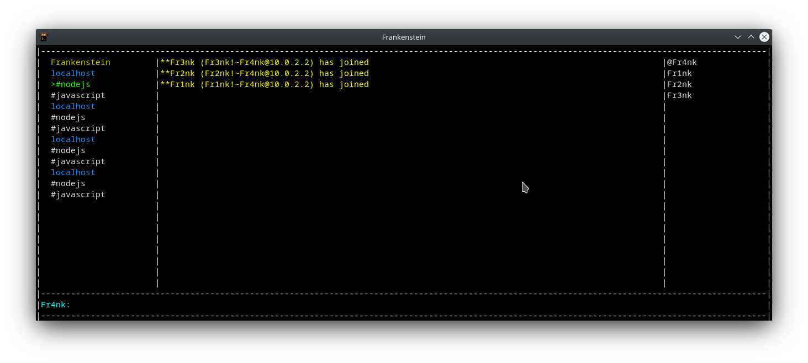

# terminal-irc-client-nodejs
terminal irc client with nodejs using terminal-kit lib

for docker

```console
cd terminal-irc-client-nodejs
docker build -t frankenstein . <---- dont forget the dot!
docker run -it frankenstein
```
## flags:
* -s [server/port] "server and port".
* -n [nickname] "nickname".
* -u [username] "username".
* -r ["realname"] "realname, must be wraped with quotes".
* -c ["#channel1 #channel2"] "channels to be joined on connect, must be wraped with quotes and separated with a space".
* -p [serverpassword] "server password".
* -i [password] "nickname password for NickServe auto identification".
* -t "use tls connection".
* -a "reject invalid certificates" // its false by default.

<span style="color:red">Warning all passwords are stored as plain text!</span>

## /server

### options: 

* show [name] "shows a specific saved profile".
* show "lists all saved profile".
* show all "lists all saved profile".
* add [name] "adds a profile".
* del [name] "deletes a profile".

##### usage : /server add libera -s irc.libera.chat/6667 -n Fr4nk -u Frankie -r "monster" -c "#javascript"


<span style="color:red">Warning all passwords are stored as plain text!</span>


## /connect

### example1 : /connect -s irc.libera/6667 -n Fr4nk -c "#javascript"
### example2 : /connect [profilename]

* /query
* /close
* /join
* /kick
* /ban
* /unban
* /op
* /deop 
* /voice
* /devoice
* /clear
* /mode
* /ns // /ns identify nickname password.
* /memory // check memory.
* /error // invoke connection error.
* /timeout // invoke timeout.
* /test // checks event listeners for leaks.
* /test2 // checks tls socket.
* /raw // toggle server's status buffer tag view to raw.
* /quit

## navigation
* ALT + Q and ALT + A to scroll channels
* UP arrow key and Down arrow key to scroll nicknames
* PAGE_UP and PAGE_DOWN to scroll Main
* TAB to auto complete a nickname

## Screenshot
